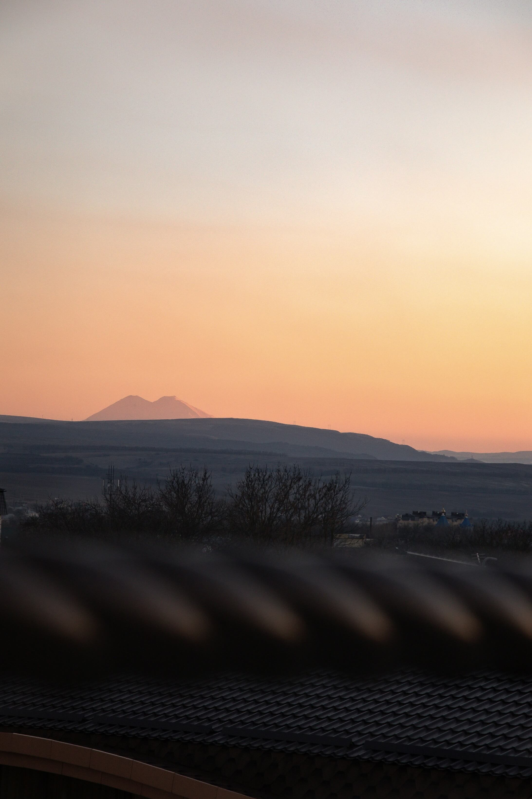

# Проект: Место

 * Создание файловой структуры CSS по методолгии БЭМ.
 * Использование позиционирования по Flex и Grid технологиям.
 * Создание возможности редактирования имени и информации о пользователе. 
 * Подключение javascript файла и написание в нем кода для работы кнопок сайта.
 * Оптимизация изображений чтобы сайт загружался быстрее (https://tinypng.com/).

### Обзор

* Figma
* Картинки

**Figma**

* [Ссылка на макет в Figma](https://www.figma.com/file/2cn9N9jSkmxD84oJik7xL7/JavaScript.-Sprint-4?node-id=0%3A1)
* [Ссылка сайт в Git](https://marat1234521.github.io/mesto/)

**Картинки**

Удачи!
